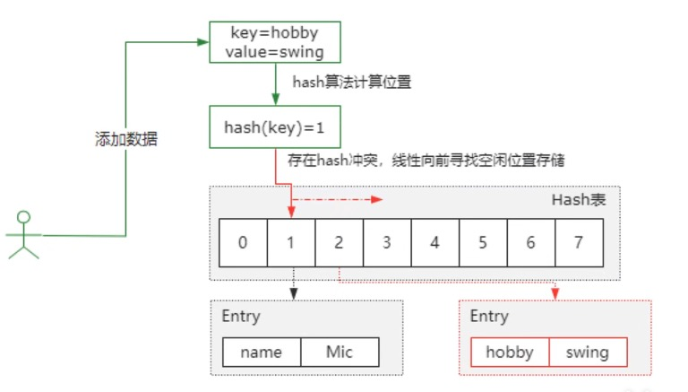
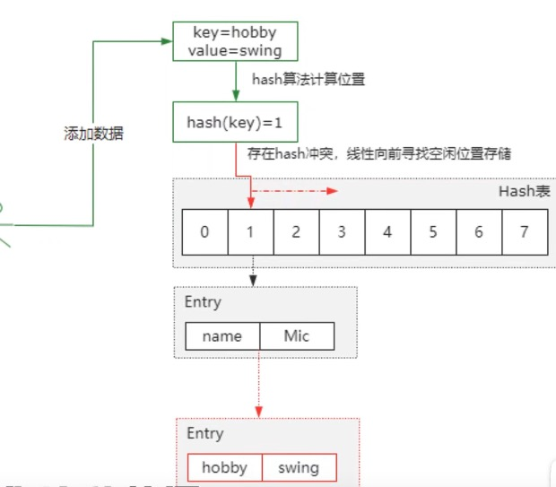

#### 1、Hash算法和Hash表

了解Hash冲突首先了解Hash算法和Hash表：

1. hash算法就是把任意长度的输入通过散列算法编程固定长度的输出，这个输出结果就是一个散列值；
2. hash表又叫做 "散列表" ，它是通过key直接访问到内存存储位置的数据结构，在具体的实现上，我们通过hash函数，把key映射到表中的某个位置，来获取这个位置的数据，从而加快数据的查找。

#### 2、Hash冲突

Hash冲突是由于哈希算法，被计算的数据是无限的，而计算后的结果的范围是有限的，总会存在不同的数据，经过计算之后得到的值是一样，那么这个情况下就会出现所谓的哈希冲突。

#### 3、解决Hash冲突的方法有四种

①开放地址法也称线性探测法，就是从发生冲突的那个位置开始，按照一定次序从Hash表找到一个空闲位置然后把发生冲突的元素存入到这个位置，而在Java中，ThreadLocal就用到了线性探测法来解决Hash冲突。

如图，在Hash表索引1的位置存了key=name，再向它添加key=hobby的时候，假设计算得到的索引也是1，那么这个时候发生哈希冲突，而开放开放定址法就是按照顺序向前找到一个空闲的位置，来存储这个冲突的key。

②链式寻址法，这是一种常见的方法，简单理解就是把存在的Hash冲突的key，以单向链表来存储，比如HashMap。

如图存在Hash冲突的key直接以单向链表的方式进行存储。

③再Hash法，就是通过某个Hash函数计算的key，存在冲突的时候，再用另外一个Hash函数对这个可以进行Hash，一直运算，直到不再产生冲突为止，这种方式会增加计算的一个时间,性能上呢会有一些影响

④建立公共移除区，就是把Hash表分为基本表和益处表两个部分，凡是存在冲突的元素，一律放到益处表中