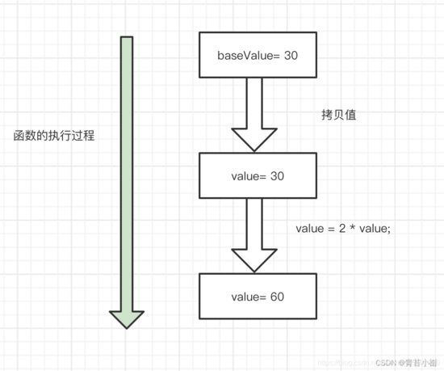
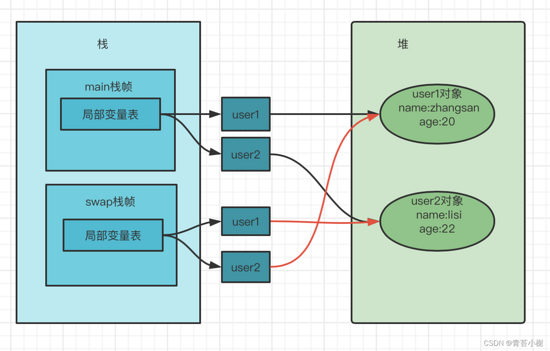
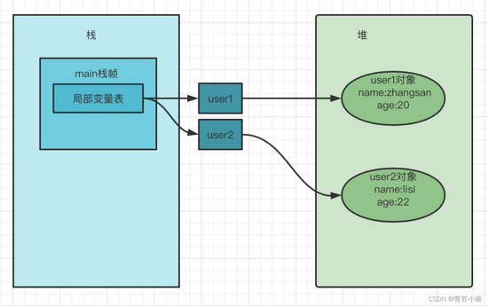
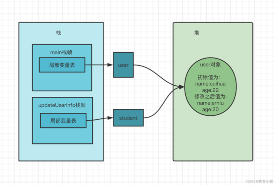
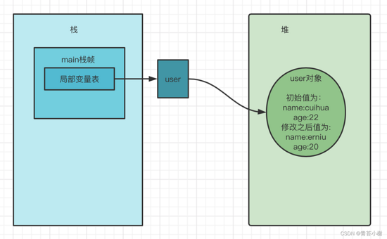

# 值传递与引用传递

#### 一.声明

Java中没有引用传递

#### 二.值传递和引用传递

值传递：就是在方法调用的时候，实参是将自己的一份拷贝赋给形参，在方法内，对该参数值的修改不影响原来的实参。

引用传递：是在方法调用的时候，实参将自己的地址传递给形参，此时方法内对该参数值的改变，就是对该实参的实际操作。

#### 三.举证

#### 3.1 做运算

private static int baseValue= 30;

        public static void updateBaseValue(int value){
     
            value = 2 * value;
        }
    
        public static void main(String[] args) {
     
            System.out.println("调用前baseValue的值："+baseValue);
            updateBaseValue(baseValue);
            System.out.println("调用后baseValue的值："+baseValue);
        }
结果：

调用前baseValue的值：30

调用后baseValue的值：30

可以看到，baseValue的值并没有发生变化。

结果分析：

1）value被初始化为baseValue值的一个拷贝（30）

2）value被乘以2后等于60，但baseValue的值仍为30

3）这个方法结束后，参数变量value不再使用，被回收。

#### 3.2 基本数据类型的交换

public static void main(String[] args) {

        int A = 2;
        int B = 3;
        swap(A, B);
        System.out.println("swap后A的结果为："+A);
        System.out.println("swap后B的结果为："+B);
    }
    
    public static void swap(int a, int b){
     
        int tmp = a;
        a = b;
        b = tmp;
    }
结果：

swap后A的结果为：2

swap后B的结果为：3

结果分析：

1）ab被初始化为AB值的一个拷贝（a=2;b=3）

2）ab的值被交换后，但AB的值没有变化

3）这个方法结束后，参数变量ab不再使用，被回收。

#### 3.3 引用数据类型的交换

public class User {

    private String name;
    private int age;
    public User(String name, int age) {
     
        this.name=name;
        this.age=age;
    }
    public String getName() {
     
        return name;
    }
    public void setName(String name) {
     
        this.name = name;
    }
    public int getAge() {
     
        return age;
    }
    public void setAge(int age) {
     
        this.age = age;
    }
    
    public String toString() {
     
        return "name:"+name+ "  age:"+age;
    }
}

public static void main(String[] args) {

        User user1 = new User("zhangsan",20);
        User user2 = new User("lisi",22);
        System.out.println("交换前user1：" + user1 + "-》 user2：" + user2);
        swap(user1,user2);
        System.out.println("交换后user1：" + user1 + "-》 user2：" + user2);
    }
    
    private static void swap(User user1, User user2) {
     
        User tmp = v;
        user1 = user2;
        user2 = tmp;
    }
结果：

交换前user1：name:zhangsan age:20-》 user2：name:lisi age:22

交换后user1：name:zhangsan age:20-》 user2：name:lisi age:22

结果分析：

执行swap方法：

swap方法结束后，临时副本user1和user2被回收

原user1和user2变量仍然指向之前的对象，没有任何改变

#### 3.4 你以为是引用传递，实际并不是

public static void updateUserInfo(User student){

            student.setName("erniu");
            student.setAge(20);
        }

        public static void main(String[] args) {
     
            user = new User("cuihua",22);
            System.out.println("调用前user的值："+user.toString());
            updateUserInfo(user);
            System.out.println("调用后user的值："+user.toString());
        }
结果：

调用前user的值：name:cuihua age:22

调用后user的值：name:erniu age:20

结果分析：

当updateUserInfo方法执行完后，参数变量student不再使用，被回收。

