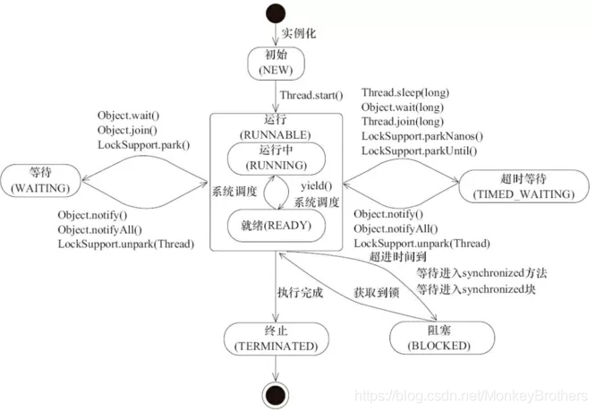

# 线程两次调用start()方法会发生什么？

​	Java的线程是不允许启动两次的，第二次调用必然会抛出 IllegalThreadStateException，这是一种运行时异常，多次调用 start 被认为是编程错误。

​	用线程的生命周期来回答此问题：

​		线程的生命周期图：

​	可以看到，只有处于NEW状态的线程才能够执行 "start ( )" 方法，也就是第二次调用 "start ( )" 方法的时候，线程可能终止或者其他非NEW的状态，因为无论如何都是不能够重复的。