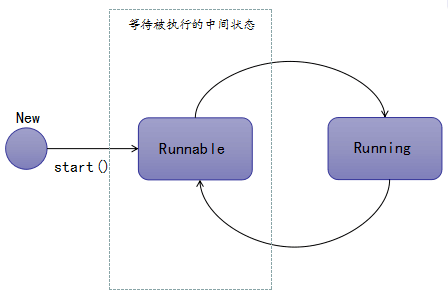

# 线程的生命周期

#### 线程的生命周期包含5个阶段：

- **新建：**就是刚使用new方法，new出来的线程；
- **就绪：**就是调用线程的 start（）方法之后，这时线程处于等待CPU分配资源阶段，谁先抢到CPU资源，谁开始执行；
- **运行：**当就绪的线程被调度并获得CPU资源时，便进入运行状态，run（）方法定义了线程的操作和功能；
- **阻塞：**在运行状态的时候，可能因为某些原因导致运行状态的线程变成了阻塞状态，比如sleep（）、wait（）之后线程就处于了阻塞状态，这个时候需要其他机制将处于阻塞状态的线程唤醒，比如调用notify（）或者notifyAll（）方法。唤醒的线程不会立即执行run（）方法，它们要再次等待CPU分配资源进入运行状态；
- **销毁：**如果线程正常执行完毕后或线程被提前强制性终止或出现异常导致结束，那么线程就要被销毁，释放资源。

#### 完整的生命周期图如下：


#### 新建状态

```java
Thread t1 = new Thread();
```

这里的创建，仅仅是在Java的这种编程语言层面被创建，而在操作系统层面，真正的线程还没有被创建。只有当我们调用了start（）方法之后，该线程才会被创建出来，进入Runnable状态。


#### 就绪状态

调用start（）方法后，JVM进程会去创建一个新的线程，而此线程不会马上被CPU调度运行，进入Running状态，这里会有一个中间状态，就是Runnalbe状态，可以理解为等待CPU调度状态。



那么处于Runnable状态的线程能发生哪些状态改变？


Runnable状态的线程无法直接进入Blocked状态和Terminated状态的。只有处在Running状态的线程，换句话说，只有获得CPU调度执行权的线程才有资格进入Blocked状态和Terminated状态，Runnable状态的线程要么被转换为Running状态，要么被意外终止。

#### 运行状态

当CPU调度发生，并从任务队列中选中了某个Runnable线程时，该线程会进入Running执行状态，并且开始调用run（）方法中的逻辑代码。

那么处于Running状态的线程能发生哪些状态的改变？


- 被转换成Terminated状态，比如调用stop（）方法；
- 被转换成Blocked状态：

- - 比如调用了sleep（），wait（）方法被加入waitSet中；
  - 比如进行了IO阻塞操作，如查询数据库进入阻塞状态；
  - 比如获取某个锁的释放，而被加入该锁的阻塞队列中；

- 该线程的时间片用完，CPU再次调度，进入Runnable状态；
- 线程主动调用yield（）方法，让出CPU资源，进入Runnable状态。

#### 阻塞状态

Blocked状态的线程能够发生哪些状态的改变？


- 被转换成Terminated状态，比如调用stop（）方法，或者是JVM意外Crash；
- 被转换成Runnable状态，比如阻塞时间结束；读取到了数据库数据后；
- 完成了指定时间的休眠，进入到Runnable状态；
- 正在wait中的线程，被其它线程调用notify / notifyAll方法唤醒，进入到Runnable状态；
- 线程获取到了想要的锁资源，进入Runnable状态；
- 线程在阻塞状态下被打断，如其它线程调用了interrupt方法，进入到Runnable状态；

#### 终止状态

一旦线程进入到Terminated状态，就意味着这个线程生命的终结，哪些情况下，线程会进入到Terminated状态呢？

- 线程正常运行结束，生命周期结束；
- 线程运行过程中出现意外错误；
- JVM异常结束，所有的线程生命周期均被结束。