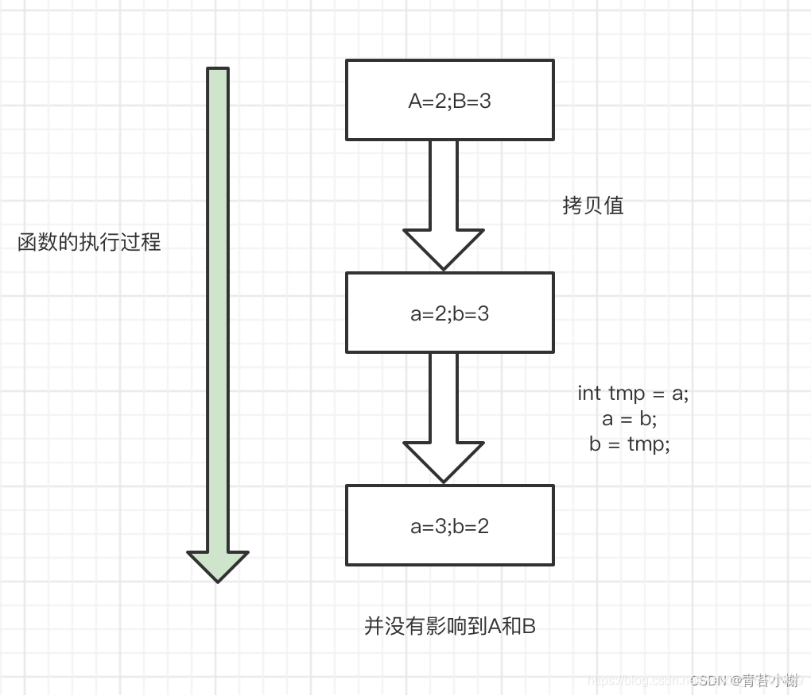

## 一、JWT简介
说JWT之前先简单了解下token：
#### 什么是token？
token的意思是“令牌”，是服务器端生成的一串字符串，作为客户端进行请求的一个标识。
当用户第一次登陆后，服务器生成一个token并将token返回给客户端，以后客户端只需要带上这个token前来请求数据即可，无需再次带上用户名和密码。
#### 使用token的目的？
减轻服务器压力，减少频繁的查询数据库。
#### token进行用户身份验证的流程：

1. 客户端使用用户名和密码请求登录；
2. 服务端收到请求，验证用户名和密码；
3. 验证成功后，服务器会签发一个token，再把这个 token 返回给客户端；
4. 客户端收到 token 后可以把它存储起来，比如放到cookie中；
5. 客户端每次向服务端请求资源时需要携带服务端签发的token，可以在cookie或者header中携带；（如果使用过postman应该很了解）
6. 服务端收到请求，然后去验证客户端请求里面带着的token，如果验证成功，就向客户端返回请求数据。

这种基于 token 的认证方式相比传统的 session 认证方更加节约服务器资源，并且对移动端和分布式更加友好。其优点如下：

- 支持跨域访问：cookie 是无法跨域的，而 token 由于没有用到 cookie（前提是将 token 放到请求头中），所以跨域后不会存在信息丢失问题；
- 无状态：token 机制在服务端不需要存储 session 信息，因为 token 自身包含了所有登录用户的信息，所以可以减轻服务端压力
- 更适用于移动端：当客户端是非浏览器平台时，cookie 是不被支持的，此时采用 token 认证方式会简单很多；
- 无需考虑CSRF：由于不在依赖 cookie，所以采用 token 认证方式不会发生CSRF，所以也无需考虑CSRF的防御。

而 JWT 就是上述流程当中 token 的一种具体实现方式，其全称是：JSON Web Token，官网地址：https://jwt.io/

通俗的说，JWT 的本质就是一个字符串，它是将用户信息保存到一个Json字符串中，然后进行编码后得到一个 JWT token，并且这个 JWT token 带有签名信息，接收后可以校验是否被篡改，所以可以用于在各方之间安全的将信息作为Json对象传输。
#### JWT认证流程

1. 首先，前端通过Web表单将自己的用户名和密码发送到后端的接口，这个过程一般是一个 POST 请求；（建议的方式是通过SSL加密的传输（HTTPS），从而避免敏感信息被嗅探）
2. 后端核对用户名和密码成功后，将包含用户信息的数据作为JWT的 Payload，将其与JWT Header 分别进行Base64编码拼接后签名，形成一个JWT Token，形成的 JWT Token 就是一个如同 lll.zzz.xxx 的字符串；
3. 后端将 JWT Token 字符串作为登录成功的结果返回给前端，前端可以将返回的结果保存在浏览器中，退出登录时删除保存的 JWT Token即可；
4. 前端在每次请求时将JWT Token 放入HTTP请求头中的 Authorization 属性中（解决XXS和XSRF问题）
5. 后端检查前端传送过来的 JWT Token，验证其有效性，比如检查签名是否正确、是否过期、token的接收方是否是自己等；
6. 验证通过后，后端解析出 JWT Token 中包含的用户信息，进行其它逻辑操作（一般是根据用户信息得到权限等），返回结果。



#### JWT认证的优势
对比传统的 session 认证方式，JWT 的优势是：

- 简洁：JWT Token 数据量小，传输速度也很快；
- 因为JWT Token是以JSON加密形式保存在客户端的，所以JWT是跨语言的，原则上任何Web形式都支持；
- 不需要在服务端保存会话信息，也就是说不依赖于cookie和session，所以没有了传统session认证的弊端，特别适用于分布式微服务；
- 单点登录友好：使用Session进行身份认证的话，由于cookie无法跨域，难以实现单点登录。但是token可以被保存在客户端的任意位置的内存中，不一定依赖于cookie和session，所以不会存在这些问题；
- 适用移动端应用：因为不依赖cookie和session；
## 二、JWT的组成
JWT由三部分组成：标头（Header）、有效载荷（Payload）和签名（Signature）。
在传输的时候，会将JWT的三部分分别进行Base64编码后用  .  进行连接形成最终传输的字符串。
#### 1、Header
JWT头 是一个描述JWT元数据的JSON对象，alg属性表示签名使用的算法，默认为HMAC SHA256(写为HS256)；typ属性表示令牌的类型，JWT令牌统一写为JWT。最后，使用Base64 URL算法将上述JSON对象转换为字符串保存。
```java
{
    "alg":"HS256",
    "typ":"JWT"
}
```
#### 2、Payload
有效载荷 部分，是JWT的主体内容部分，也是一个JSON对象，包含需要传递的数据，JWT指定七个默认字段供选择
```java
iss：发行人
exp：到期时间
sub：主题
aud：用户
nbf：在此之前不可用
iat：发布时间
jti：JWT ID用于标识该JWT
```
除以上默认字段外，我们还可以自定义私有字段，一般会把包含用户信息的数据放到payload中，如下：
```java
{
  "sub": "123456",
  "name": "moyujian",
  "admin": true
}

```
注意：
> 默认情况下JWT是未加密的，因为只是采用Base64算法，拿到JWT字符串后可以转换回原本的JSON数据，任何人都可以解读其内容，因此不要构建隐私信息字段，比如用户的密码等，以防止信息泄露，JWT只适合在网络中传输一些非敏感的信息

#### 3、Signature
签名哈希 部分是对上面两部分数据签名，需要使用Base64编码后的header和payload数据，通过指定的算法生成哈希表，以确保数据不会被篡改。
## 三、JWT的种类
其实JWT（JSON Web Token）指的是一种规范，这种规范允许我们使用JWT在两个组织之间传递安全可靠的信息，JWT的具体实现可以分为以下几种：

- nonsecure JWT：未经过签名，不安全的JWT
- JWS：经过签名的JWT
- JWE：payload 部分经过加密的JWT
#### 1、nonsecure JWT
未经过签名，不安全的JWT，其header部分没有指定签名算法
```java
{
  "alg": "none",
  "typ": "JWT"
}

```
并且也没有 Signature 部分
#### 2、JWS
JWS，也就是JWT Signature，其结构就是在之前nonsecure JWT的基础上，在头部签名算法，并在最后添加上签名。创建签名，是保证jwt不能被它人随意篡改。我们通常使用的JWT一般都是JWS。
为了完成签名，除了用到header信息和payload信息外，还需要算法的密钥，也就是secretKey。加密的算法一般有两类：

- 对称加密：secretKey 指加密密钥，可以生成签名与验签。
- 非对称加密：secretkey 指私钥，只用来生成签名，不能用来验签（验签用的是公钥）

JWT的密钥或者密钥对，一般统称为JSON Web Key，也就是 JWK.
#### JWT的签名算法有三种：

- HMAC【哈希消息验证码(对称)】：HS256/HS384/HS512
- RSASSA【RSA签名算法(非对称)】：RS256/RS384/RS512
- ECDSA【椭圆曲线数据签名算法(非对称)】：ES256/ES384/ES512
## 四、在Java中使用JWT
官网推荐了6个Java使用JWT的开源库，其中比较推荐使用的是 java-jwt 和 jjwt-root
#### 1、java-jwt
1.1、对称签名
引入依赖
```java
<dependency>
    <groupId>com.auth0</groupId>
    <artifactId>java-jwt</artifactId>
    <version>3.10.3</version>
</dependency>
```
封装成工具类
```java
public class JWTUtils {
    // 签名密钥
    private static final String SECRET = "!DAR$";

    /**
     * 生成token
     * @param payload token携带的信息
     * @return token字符串
     */
    public static String getToken(Map<String,String> payload){
        // 指定token过期时间为7天
        Calendar calendar = Calendar.getInstance();
        calendar.add(Calendar.DATE, 7);

        JWTCreator.Builder builder = JWT.create();
        // 构建payload
        payload.forEach((k,v) -> builder.withClaim(k,v));
        // 指定过期时间和签名算法
        String token = builder.withExpiresAt(calendar.getTime()).sign(Algorithm.HMAC256(SECRET));
        return token;
    }


    /**
     * 解析token
     * @param token token字符串
     * @return 解析后的token
     */
    public static DecodedJWT decode(String token){
        JWTVerifier jwtVerifier = JWT.require(Algorithm.HMAC256(SECRET)).build();
        DecodedJWT decodedJWT = jwtVerifier.verify(token);
        return decodedJWT;
    }
}
```

1.2、非对称签名
生成jwt串的时候需要指定私钥，解析jwt串的时候需要指定公钥
```java
private static final String RSA_PRIVATE_KEY = "...";
private static final String RSA_PUBLIC_KEY = "...";

/**
     * 生成token
     * @param payload token携带的信息
     * @return token字符串
     */
public static String getTokenRsa(Map<String,String> payload){
    // 指定token过期时间为7天
    Calendar calendar = Calendar.getInstance();
    calendar.add(Calendar.DATE, 7);

    JWTCreator.Builder builder = JWT.create();
    // 构建payload
    payload.forEach((k,v) -> builder.withClaim(k,v));

    // 利用hutool创建RSA
    RSA rsa = new RSA(RSA_PRIVATE_KEY, null);
    // 获取私钥
    RSAPrivateKey privateKey = (RSAPrivateKey) rsa.getPrivateKey();
    // 签名时传入私钥
    String token = builder.withExpiresAt(calendar.getTime()).sign(Algorithm.RSA256(null, privateKey));
    return token;
}

/**
     * 解析token
     * @param token token字符串
     * @return 解析后的token
     */
public static DecodedJWT decodeRsa(String token){
    // 利用hutool创建RSA
    RSA rsa = new RSA(null, RSA_PUBLIC_KEY);
    // 获取RSA公钥
    RSAPublicKey publicKey = (RSAPublicKey) rsa.getPublicKey();
    // 验签时传入公钥
    JWTVerifier jwtVerifier = JWT.require(Algorithm.RSA256(publicKey, null)).build();
    DecodedJWT decodedJWT = jwtVerifier.verify(token);
    return decodedJWT;
}
```
#### 2、jjwt-root
2.1、对称签名
引入依赖
```java
<dependency>
    <groupId>io.jsonwebtoken</groupId>
    <artifactId>jjwt</artifactId>
    <version>0.9.1</version>
</dependency>
```
封装成工具类
```java
public class JwtUtils {
    // token时效：24小时
    public static final long EXPIRE = 1000 * 60 * 60 * 24;
    // 签名哈希的密钥，对于不同的加密算法来说含义不同
    public static final String APP_SECRET = "ukc8BDbRigUDaY6pZFfWus2jZWLPHO";

    /**
     * 根据用户id和昵称生成token
     * @param id  用户id
     * @param nickname 用户昵称
     * @return JWT规则生成的token
     */
    public static String getJwtToken(String id, String nickname){
        String JwtToken = Jwts.builder()
                .setHeaderParam("typ", "JWT")
                .setHeaderParam("alg", "HS256")
                .setSubject("baobao-user")
                .setIssuedAt(new Date())
                .setExpiration(new Date(System.currentTimeMillis() + EXPIRE))
                .claim("id", id)
                .claim("nickname", nickname)
            	// HS256算法实际上就是MD5加盐值，此时APP_SECRET就代表盐值
                .signWith(SignatureAlgorithm.HS256, APP_SECRET)
                .compact();

        return JwtToken;
    }

    /**
     * 判断token是否存在与有效
     * @param jwtToken token字符串
     * @return 如果token有效返回true，否则返回false
     */
    public static boolean checkToken(String jwtToken) {
        if(StringUtils.isEmpty(jwtToken)) return false;
        try {
            Jwts.parser().setSigningKey(APP_SECRET).parseClaimsJws(jwtToken);
        } catch (Exception e) {
            e.printStackTrace();
            return false;
        }
        return true;
    }

    /**
     * 判断token是否存在与有效
     * @param request Http请求对象
     * @return 如果token有效返回true，否则返回false
     */
    public static boolean checkToken(HttpServletRequest request) {
        try {
            // 从http请求头中获取token字符串
            String jwtToken = request.getHeader("token");
            if(StringUtils.isEmpty(jwtToken)) return false;
            Jwts.parser().setSigningKey(APP_SECRET).parseClaimsJws(jwtToken);
        } catch (Exception e) {
            e.printStackTrace();
            return false;
        }
        return true;
    }

    /**
     * 根据token获取会员id
     * @param request Http请求对象
     * @return 解析token后获得的用户id
     */
    public static String getMemberIdByJwtToken(HttpServletRequest request) {
        String jwtToken = request.getHeader("token");
        if(StringUtils.isEmpty(jwtToken)) return "";
        Jws<Claims> claimsJws = Jwts.parser().setSigningKey(APP_SECRET).parseClaimsJws(jwtToken);
        Claims claims = claimsJws.getBody();
        return (String)claims.get("id");
    }
}
```

2.2、非对称签名
生成jwt串的时候需要指定私钥，解析jwt串的时候需要指定公钥
```java
private static final String RSA_PRIVATE_KEY = "...";
private static final String RSA_PUBLIC_KEY = "...";

/**
     * 根据用户id和昵称生成token
     * @param id  用户id
     * @param nickname 用户昵称
     * @return JWT规则生成的token
     */
public static String getJwtTokenRsa(String id, String nickname){
    // 利用hutool创建RSA
    RSA rsa = new RSA(RSA_PRIVATE_KEY, null);
    RSAPrivateKey privateKey = (RSAPrivateKey) rsa.getPrivateKey();
    String JwtToken = Jwts.builder()
        .setSubject("baobao-user")
        .setIssuedAt(new Date())
        .setExpiration(new Date(System.currentTimeMillis() + EXPIRE))
        .claim("id", id)
        .claim("nickname", nickname)
        // 签名指定私钥
        .signWith(privateKey, SignatureAlgorithm.RS256)
        .compact();
    return JwtToken;
}

/**
     * 判断token是否存在与有效
     * @param jwtToken token字符串
     * @return 如果token有效返回true，否则返回false
     */
public static Jws<Claims> decodeRsa(String jwtToken) {
    RSA rsa = new RSA(null, RSA_PUBLIC_KEY);
    RSAPublicKey publicKey = (RSAPublicKey) rsa.getPublicKey();
    // 验签指定公钥
    Jws<Claims> claimsJws = Jwts.parserBuilder().setSigningKey(publicKey).build().parseClaimsJws(jwtToken);
    return claimsJws;
}
```
## 五、实际开发中的应用
在实际的SpringBoot项目中，一般我们可以用如下流程做登录：

- 在登录验证通过后，给用户生成一个对应的随机token(注意这个token不是指jwt，可以用uuid等算法生成)，然后将这个token作为key的一部分，用户信息作为value存入Redis，并设置过期时间，这个过期时间就是登录失效的时间；
- 将第1步中生成的随机token作为JWT的payload生成JWT字符串返回给前端；
- 前端之后每次请求都在请求头中的Authorization字段中携带JWT字符串；
- 后端定义一个拦截器，每次收到前端请求时，都先从请求头中的Authorization字段中取出JWT字符串并进行验证，验证通过后解析出payload中的随机token，然后再用这个随机token得到key，从Redis中获取用户信息，如果能获取到就说明用户已经登录。
```java
public class JWTInterceptor implements HandlerInterceptor {
    @Override
    public boolean preHandle(HttpServletRequest request, HttpServletResponse response, Object handler) throws Exception {
        String JWT = request.getHeader("Authorization");
        try {
            // 1.校验JWT字符串
            DecodedJWT decodedJWT = JWTUtils.decode(JWT);
            // 2.取出JWT字符串载荷中的随机token，从Redis中获取用户信息
            ...
            return true;
        }catch (SignatureVerificationException e){
            System.out.println("无效签名");
            e.printStackTrace();
        }catch (TokenExpiredException e){
            System.out.println("token已经过期");
            e.printStackTrace();
        }catch (AlgorithmMismatchException e){
            System.out.println("算法不一致");
            e.printStackTrace();
        }catch (Exception e){
            System.out.println("token无效");
            e.printStackTrace();
        }
        return false;
    }
}
```

本文简单的介绍了下JWT的一些原理，要更加的理解JWT还是需要自己动手做项目，理解其中的用法。
文章摘选自大佬文章，更加详细的请查阅大佬博客地址：[https://baobao555.tech/archives/40#%E5%AE%9E%E9%99%85%E5%BC%80%E5%8F%91%E4%B8%AD%E7%9A%84%E5%BA%94%E7%94%A8](https://baobao555.tech/archives/40#%E5%AE%9E%E9%99%85%E5%BC%80%E5%8F%91%E4%B8%AD%E7%9A%84%E5%BA%94%E7%94%A8)
